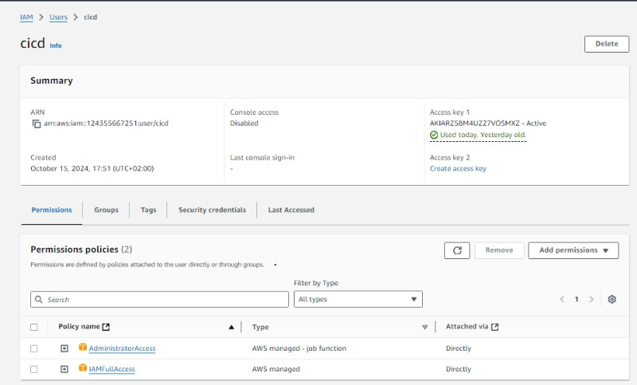
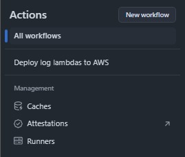

# Games Global - Technical Assessment - Serverless Functions 
 
 

# Author Details:

**Full Name** - *Ethan Schoonbee*

**University** - *Varsity College, Cape Town*

**Degree** - *Computer Science and Application Development*

**Year of Study** - *3rd Year (Final Year)*

**Email** - *schoonbeeethan@gmail.com*
 
 

# Table of Contents:
- [Introduction](#introduction)
- [Project Decisions](#project-decisions)
- [Deploying Functions to AWS](#deploying-functions-to-aws)
- [Conclusion](#conclusion)
 
 

---

# Introduction:
This project was developed as part of a technical assessment for Games Global and tested my practical implementation of AWS serverless functions.

For this project, I chose to take some risks and utilize **TypeScript** for my language of choice as I am currently trying to learn it.

I have also never utilized **Amazon AWS** or their cloud infrastructure platform before so I wanted to try it out for this project.
There were a lot of struggles with working out the intricacies of the AWS service, particularly with understanding how VPCs and services outside of them
interact with each other, but I am glad I took the chance and tried it out as it was a great learning experience.
 
 

---

# Project Decisions:
In this section, I want to explain some of the critical choices I made throughout the project:

##   Choice of Tech Stack
- **Runtime Environment:**

  - I opted for **Node.js** because of its asynchronous nature, which is particularly useful for handling API requests efficiently. Additionally, the availability of libraries for **AWS** integration made it a great fit.
- **Database Selection:**

  - **DynamoDB** was chosen because of its seamless integration with AWS services and its flexibility in managing JSON-like structures.
- **Validation with Zod:**

  - I chose **Zod** for input validation to ensure the API requests adhere to a defined schema, improving the robustness of the **Lambda** **functions**.

##   Deployment
- **GitHub Action Pipeline:**

  - I chose to use **GitHub Actions** and set up a deployment pipeline to automatically deploy the AWS environment and lambda functions to a specified AWS account.
  - This only works in GitHub, as secrets and variables must be added to the forked repository to build correctly.
  - I did this under the assumption that because we are required to push the code to GitHub, the evaluators would have access to a GitHub account and therefore
can deploy from it.
 
 

---

# Deploying Functions to AWS:
To deploy the serverless functions to AWS, follow these steps:
 
 

## 1. Create a AWS Account

#### I wont guide you through the creation but ensure you have an AWS account before proceeding.
 
 

## 2. Navigate to the IAM Service

#### Search for and select the '*IAM* ' service from any page on the AWS website.

  

#### This is what the IAM Dashboard should look like.

  

 
 

## 3. Create a new IAM user

#### Locate the '*User* ' section in the menu to the left.

  

#### Click the '*Create user* ' button in the top left.

  

#### Select a user name that is unique to any other possible users on your AWS account.

  

#### Select the '*Attach policies directly* ' option.

  

#### Search and select '*AdministratorAccess* ' and '*IAMFullAccess* ' policies.

  

  

#### Finally review the details and click '*Create user* '.

  

 
 

## 4. Create an Access Key

#### Navigate back to the '*Users* ' page and you should see the new user that you created. Click the user's name in blue.

  

#### These are your user's settings. In the navigation bar located below the '*Summary* ' select the *'Security credentials* ' section.

  

#### Scoll down until you locate the '*Access Keys* ' section and Click the '*Create access key* ' button at the top right.
#### This will take you through the process of creating a new access key we will need later.

  

#### Select '*Command Line Interface (CLI)* ' for the use case. Tick the confirmation box at the bottom and press '*Next* '.

  

#### You can add a description to this key if you would like but you are more than welcome to skip it as well it won't affect anything.

  

#### Your Access Key has now been created! Copy the "*Access key* ' and '*Secret access key* ' and keep them safe as we will use them later.

  

 
 

## 5. Fork the Repository

#### Navigate to the top of this GitHub repository and press the '*Fork* ' button located in the top right between '*Watch* ' and '*Star* '.

  

#### Create a '*Fork* ' of my repository on your account. You are welcome to rename it and add your own description :)

  

#### This will create a forked repository on your GitHub account with all my code. We will be working on this forked repository from now on.

  

#### At this point you are also able to clone the code to your machine if you wish to see how many comments I was able to fit on one file.

  

  

 
 

## 6. Add Secrets and Variables for GitHub Actions Pipeline

#### Within your forked repository at the very top you will see a navigation bar. Press the '*Settings* ' option on the far right.

  

#### In your repository settings page you will see a menu to the left side. Locate and press the '*Secrets and variables* ' option under '*Security* '.

  

#### When you click it a few options will appear. Press the one called '*Actions* '.

  

#### This will open a page where we can add our Secrets and Variables for our GitHub Actions Pipeline.
#### Press the green '*New repository secret* ' button.

  

#### You need to create a secret called '*AWS_ACCESS_KEY_ID* ' and paste in the Access Key for our IAM user we created (remember the secrets I told you to keep safe).
#### It will look something like this: **XZPMA1BCY9WQDLGT3JHK**  
*NOTE THAT THIS IS NOT A REAL ACCESS KEY*

  

#### You will also create another secret called '*AWS_SECRET_ACCESS_KEY* ' and paste in the Secret Access Key I also told you to keep safe.

  

#### You should now have these Secrets with the values inside.

  

#### Just above where these Secrets are you will see a tab called '*Variables* '. Press it!!!!!!
#### This is where we will add our Variables for our GitHub Actions Pipeline. Press the green '*New repository variable* ' button.

  

#### You need to create a variable called '*AWS_REGION* ' which will hold your selected region for AWS. I use '*us-east-1* ' as my default.
#### If you are unsure you can use the same region as me.

  

#### Add variables called '*READER_ECR_REPO* ' & '*WRITER_ECR_REPO* ' that will hold the names of your ECR repositories for the reader and writer lambda functions.
#### You can name them anything as long as there are no other repositories with the same name in the ECR of your chosen region.

  

  

#### Add variables called '*READER_FUNCTION_NAME* ' & '*WRITER_FUNCTION_NAME* ' that will hold the names of your reader and writer lambda function respectively.
#### Once again you can name these anything as long as there are no other lambda functions with the same name in your chosen region.

  

  

#### You should now have these Variables with the values inside.

  

 
 

## 7. Run Pipeline and Deploy to AWS

#### In the top navigation bar of your repository, click the option called '*Actions* '.

  

#### This will open up your GitHub Actions page where all your pipeline workflows are held.
#### On the left-hand side you will see a menu listing the currently available workflows.
#### Locate the workflow called '*Deploy log lambdas to AWS* ' and click it.

  

#### To the right you will see the workflows that have run already.
#### There may be a failed workflow already. Don't worry this is because we didn't have your Secrets and Variables.
#### On the right side there is a grey button called '*Run workflows* ' click it.

  

#### A popup will appear. Click the green '*Run workflows* ' button.
#### This will start your deployment to your AWS account.

  

#### A new workflow will appear on your page (you may need to refresh) and will appear orange as it works away.

  

#### If you click on that new workflow you can see each job that is completed one by one.

  

#### After about 15 minutes all the jobs should show green, meaning they all worked and it should be deployed to AWS!!!

  

 
 

## 8. Accessing the Lambda Functions

#### Once your deployment pipeline on GitHub succeeds you can navigate back to the AWS website.
#### Search for the '*CloudFormation* ' service and open it.

  

#### This will take you to a page to view the current stack and all services that were just deployed by the pipeline we just ran.
#### All of them should say either 'CREATE_COMPLETE' or 'UPDATE_COMPLETE'. If so then WHOO HOOO!!!

  

#### To run the functions you need to access their URL. If you select the '*log-reader-lambda-function-stack* ' from your CloudFormation stack
you should see a pop-up similar to this

  

#### Pressing the '*Outputs* ' tab at the top will take you to this section.
#### Here is where you can access your URL for the reader lambda function under '*LambdaFunctionUrl* '.

  

#### This will be the same for accessing the writer lambda function URL.

  

 
 

## 9. Running the Lambda Functions

#### There are many ways to run and use these lambda functions. The way found best and used for my testing was to utilize an application called **Postman**.
#### Postman allows you to send CRUD requests to URL endpoints and receive the responses.

#### Here is my Postman test for the writer lambda function:
#### Keep in mind the writer lambda function only accepts:
- POST method requests
- A severity of
  - info
  - warning
  - error
 

  

#### Here is my Postman test for the reader lambda function:
#### Keep in mind the reader lambda function only accepts:
- GET method requests
 

  

 
 

## 10. Tearing down the CloudFormation Stack (NB)

#### Make sure to tear down your CloudFormation stack when you are done using and testing the lambda functions as Private Link used to access DynamoDB costs money on a time usage basis.
#### Because some stacks depend on others for resources make sure to tear down the stacks in this order:

#### 1. log-reader-lambda-function-stack
#### 2. log-writer-lambda-function-stack
#### 3. dynamodb-stack
#### 4. private-link-stack
#### 5. security-groups-stack
#### 6. ecr-stack
#### 7. network-stack

 
 

## Conclusion:
This project provided a valuable opportunity to explore serverless architectures, and I gained hands-on experience with AWS Lambda, DynamoDB, TypeScript, and setting up a CI/CD pipeline with GitHub Actions. Despite the challenges, especially with the AWS environment, I found the experience highly rewarding and educational.
 
 
